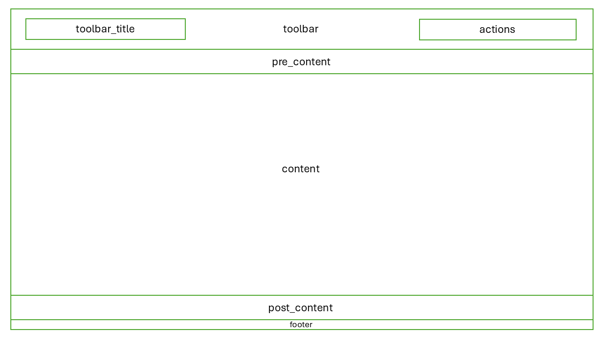

==================
Working with Trame
==================

At it's core, Trame is going to do two things:

1. It will create and run a web server that hosts your application.
2. It will automatically generate a `Vue-based webpage <https://vuejs.org/>`_ that will connect to the web server.

++++++++++
Components
++++++++++

When building your UI, you will be working with Vue `components`. A component is a reusable block of code that implements some UI functionality. For example, in the new application from the previous section, :code:`vuetify.VBtn("Hello World")` is a component.

With Trame, you can use components both provided by Trame itself and by third-party libraries that Trame supports, such as `Vuetify <https://vuetifyjs.com/en/>`_. The full list of components available in Trame is available `here <https://trame.readthedocs.io/en/latest/trame.widgets.html>`_. We also provide a few custom components that are described in the :ref:`API <api_components>`.

To use a component, you can do the following:

.. code-block:: python

    with html.Div():
        with vuetify.VList():
            vuetify.VListItem("Item 1")
            vuetify.VListItem("Item 2")

The :code:`with` syntax will create a hierarchy of components that matches the structure of typical HTML elements. The above snippet would create an HTML div element, with a Vuetify list as a child, and two Vuetify list items as children of the list.

+++++++++++++++
Layouts & Slots
+++++++++++++++

When you ran the example application, you also likely noticed that there was more content on the page than just the button component that was added. This is because of the `layout` that the button is a child of. A layout provides a
common structure for applications and defines sections of the page into which you can inject content. These sections are referred to as `slots`. In the example application, the button was added to the `content` slot of the layout, which happens to correspond to the main content area of the page.

If you want to customize a slot, you can either completely replace it or add child content to it. To replace it completely, you can do the following:

.. literalinclude:: ../src/trame_facade/theme.py
    :start-after: slot override example
    :end-before: slot override example complete
    :dedent:

If you want to add children to a slot, you can do the following:

.. literalinclude:: ../tests/gallery/app.py
    :start-after: slot child example
    :end-before: slot child example complete
    :dedent:

Below is an image of all of the usable slots that are available in the layout created by :code:`trame-facade`:

Note that the :code:`layout.toolbar`, :code:`layout.toolbar_title`, or :code:`layout.footer` slots only be completely replaced if you wish to customize them. Appending child content will likely break your page.

+++++++
Theming
+++++++

In order to give applications a consistent look and feel, all applications built with :code:`trame-facade` are based on the `Vuetify <https://vuetifyjs.com/en/>`_ framework. One of the most important features that Vuetify provides is the ability to theme your application. This allows you to easily change the colors, fonts, and other visual elements of your application. We provide a default theme that we recommend you use, but you can modify it or completely replace it if needed.

For details on manipulating the theming, see the :ref:`API <api_theme>`.
